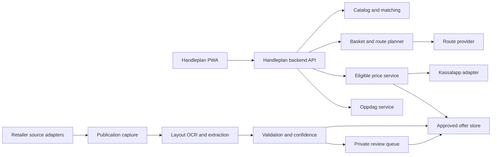

# Handleplan Product and System Design

**Date:** 2026-07-15  
**Status:** Approved concept, ready for implementation planning  
**Initial market:** Norwegian grocery shoppers  

## 1. Summary

Handleplan is a public-good grocery planning web application that helps a shopper decide where to buy a complete basket. It combines current product prices, verified retailer offers, optional travel time, and the shopper's substitution preferences. Instead of optimizing for price alone, it presents the meaningful trade-off between savings and convenience.

The product has one shared basket and two complementary surfaces:

- **Planlegg** is the primary experience. The user describes what they need, confirms important product matches, and receives complete plans using one, two, or at most three stores.
- **Oppdag** is the discovery experience. It surfaces relevant, explainable opportunities from price history and retailer offers and shows how each opportunity would affect the current plan.

The central interaction is a discrete convenience–savings slider. Each position represents a real, complete, non-dominated shopping plan—not an invented percentage or opaque score.

## 2. Product principles

1. **Public good first.** Recommendations are never sponsored. There are no behavioral ads, pay-to-rank placements, or hidden commercial incentives.
2. **A complete basket beats a misleading bargain.** A plan may be recommended only when every required item has an eligible price or an explicitly approved substitution.
3. **Savings and effort are both real costs.** The app shows basket total, number of stops, optional travel time, and substitutions together.
4. **No more than three stores.** One, two, and three-store plans are actionable. Larger combinations are excluded from recommendations.
5. **Explain every recommendation.** Users can inspect product matches, price sources, offer conditions, freshness, geographic scope, and why a plan differs from another.
6. **Anonymous by default.** Core functionality requires no account. Basket, preferences, and recent local history remain in the browser.
7. **Fail closed.** Ambiguous, expired, geographically unknown, or stale information cannot silently win a recommendation.

## 3. Goals and non-goals

### 3.1 First usable release goals

- Let an anonymous user build a grocery basket using natural-language needs or exact products.
- Calculate complete plans across Bunnpris, REMA 1000, and Extra.
- Show one-to-three-store alternatives across the convenience–savings frontier.
- Fetch and interpret direct public retailer flyers automatically, including regional or local editions when the retailer exposes them.
- Support a small private review queue for uncertain extracted offers.
- Optionally calculate actual round-trip travel time from a user-provided origin.
- Turn the chosen plan into a mobile, store-grouped checklist that tolerates intermittent connectivity.
- Make provenance, assumptions, uncertainty, and offer conditions visible.

### 3.2 Explicit non-goals for the first release

- Proving branch-level stock availability.
- Claiming branch-specific shelf prices when only chain-level prices are known.
- Supporting more than three stores in a recommended trip.
- Automatic purchasing, delivery ordering, loyalty-card login, or coupon activation.
- User accounts, cloud basket synchronization, or social features.
- Silent AI-selected substitutions.
- Ingesting flyers from third-party aggregators.
- Displaying full copyrighted flyer imagery unless reuse rights are confirmed.
- Native mobile applications; the first release is an installable responsive web app.

## 4. Information architecture

The public application has a persistent **Handleplan** shell with two primary destinations:

- `/planlegg` — default route and basket planner.
- `/oppdag` — deal and price discovery using the same basket and pricing engine.

The chosen plan becomes a focused mobile checklist view under Planlegg. A separate authenticated `/review` surface is reserved for offer reviewers and is not linked from public navigation.

The basket, matching rules, membership preferences, slider position, transport mode, and chosen plan are shared between Planlegg and Oppdag. Adding or replacing an item in Oppdag immediately recalculates Planlegg.

## 5. Planlegg experience

### 5.1 Build the basket

The user can enter either:

- a generic need, such as “melk”, “middag til taco”, or “to pakker havregryn”; or
- an exact product by product search, EAN, or barcode.

For each generic need, the app proposes candidate products and a matching rule. The user can accept a flexible family match or constrain it by brand, size range, dietary property, or exact EAN. Quantity is explicit. Materially different products always require approval before they can satisfy a need.

The browser stores the working basket and approved matching rules locally. No precise origin is persisted unless a future, explicit opt-in setting is introduced.

### 5.2 Confirm important matches

Before calculating, the app highlights needs that are ambiguous, have unusually broad substitutions, or materially influence the plan. Users can lock an exact match or keep a clearly described flexible rule. The application never represents a product-family match as an exact-product price.

### 5.3 Calculate plans

Without location permission, plans are chain-level and travel time is omitted. If the user chooses travel calculation, they provide a temporary origin and transport mode. The first release calculates a round trip that begins and ends at that origin, choosing eligible nearby branches for each chain in the plan.

Every returned plan must:

- cover every required basket quantity;
- use no more than three chains/stores;
- obey matching, membership, and multibuy rules;
- use only eligible prices and offers;
- state any approved substitutions;
- distinguish chain-level price knowledge from suggested physical branches.

### 5.4 Navigate the trade-off

The slider contains the calculated Pareto frontier:

- The **Convenience** end selects the complete plan with the fewest stops, then the least travel time, then the lowest total.
- The **Savings** end selects the complete plan with the lowest checkout total, then the least travel time, then the fewest substitutions.
- Intermediate positions are real plans for which no other plan is both cheaper and at least as convenient.

The initial position is a balanced frontier plan near the middle, not a claim of universal optimality. The user's last selected position is remembered locally. If the frontier contains many near-identical plans, the interface presents at most seven representative positions while preserving both endpoints and meaningful changes in stop count, travel time, or total.

Moving the slider updates, without a page transition:

- checkout total;
- savings relative to the lowest-cost complete plan among the fewest-stop alternatives (normally the cheapest complete one-store plan);
- number of stops;
- travel time when enabled;
- substitutions and offer conditions;
- a short explanation of what changed.

### 5.5 Shop the plan

The selected plan becomes a mobile checklist grouped in route order. Each store group shows its suggested branch, opening hours when available, items, quantities, expected prices, offer conditions, and a subtotal. The checklist remains usable from cached application state during poor connectivity.

The page prominently states that branch stock and exact shelf prices are not guaranteed unless a future source can verify them.

## 6. Oppdag experience

Oppdag is not a wall of flyer pages. It presents structured opportunities with an explanation and provenance. Initial sections are:

- relevant to the current basket;
- meaningful drops versus recent product-price history;
- lowest eligible unit prices in common categories;
- staple products worth considering;
- browse by category, chain, and optional geographic area.

Every opportunity can be added to the basket, used to replace a current match, or saved in local browser state. The most important hybrid feature is **plan impact**, for example: “This makes Extra 38 kr cheaper but adds a second stop.” Impact is calculated by the same planner rather than by a separate deal-ranking heuristic.

A “price drop” is calculated against the median eligible observation over the preceding 30 days. It requires at least seven distinct observation days and a current observation no older than 72 hours. The UI labels this as a calculated historical comparison, not an official retailer discount.

## 7. System boundaries



### 7.1 Browser application

The browser owns anonymous user state and presentation. It sends a basket and preferences for calculation but does not receive or store the Kassalapp credential. It caches the selected plan and checklist for intermittent connectivity.

### 7.2 Handleplan backend

The backend is the only component allowed to use `KASSAL_API_KEY`. It exposes product search, planning, discovery, and branch suggestion endpoints tailored to the frontend. It enforces rate limits, timeouts, caching, retries, input validation, and response normalization so upstream API details never become the frontend contract.

### 7.3 Kassalapp adapter

The adapter uses Kassalapp as the initial product catalog, price-history source, chain price source, and physical-store directory. Bulk price lookups are batched within the upstream limit. Store and price data remain separate so a chain price cannot be mistaken for verified branch inventory or shelf price.

### 7.4 Backend persistence

Server-side persistence contains only operational and public-source data needed for the service: normalized catalog references, price cache, source publications, extracted candidates, approved offers, review actions, adapter health, and audit records. Anonymous baskets, locations, and personal preferences are not stored server-side beyond short-lived request processing and privacy-safe operational logs.

## 8. Core domain contracts

The implementation may choose its language, but it must preserve these semantic boundaries:

```text
Need
  id, query, quantity, quantityUnit, matchRuleId, required

MatchRule
  mode: exact | constrained | flexible
  exactEan?, productFamily?, allowedBrands?, sizeRange?, dietaryConstraints?
  userApproved, explanation

PriceObservation
  ean, chain, amount, packageQuantity, unitPrice?
  observedAt, source, sourceReference, geographicScope, confidence

ApprovedOffer
  id, publicationId, matchedEan? or productFamily?
  offerPrice, referencePrice?, multibuy?, membershipRequirement?
  validFrom, validUntil, geographicScope, provenance, reviewState

PlanRequest
  needs, matchingRules, membershipPreferences
  origin?, transportMode?, branchRadius?, conveniencePreference

PlanResult
  assignments, total, stores, travelTime?, route?
  substitutions, coverage, conditions, provenance, freshness, explanation
```

Geographic scope is one of `national`, `region`, `postal-code-set`, `store-id-set`, or `unknown`. An `unknown`-scope offer is never eligible to determine a public recommendation.

## 9. Flyer ingestion and offer review

### 9.1 Source policy

The first release has dedicated adapters for the grocery chains' own public flyer sources for Bunnpris, REMA 1000, and Extra. Each adapter discovers national publications and any regional, postal-code, or store-specific editions exposed by that retailer. Third-party flyer aggregators are out of scope.

Before public launch, written terms and permissions must be reviewed for fetching, processing, retaining provenance, and displaying derived offer information. Full-page or cropped retailer artwork is retained privately for verification and displayed publicly only when rights permit.

### 9.2 Pipeline

1. **Discover and capture.** The retailer adapter records the publication URL, retailer, discovered scope, retrieval time, declared validity, checksum, content type, and source metadata. Captures are immutable.
2. **Segment and extract.** Layout-aware OCR identifies offer regions. A constrained extractor produces typed candidates rather than free-form prose.
3. **Normalize and match.** Candidates are normalized for product name, brand, package size, quantity, price, unit price, multibuy terms, membership conditions, dates, and geography, then matched to Kassalapp EANs where confidence permits.
4. **Validate.** Deterministic rules check dates, arithmetic, units, missing conditions, geographic scope, duplicates, and anomalous prices.
5. **Decide.** High-confidence candidates auto-publish; medium-confidence candidates enter review; low-confidence candidates are rejected.
6. **Review.** A reviewer sees the original private source crop beside editable structured fields and can approve, correct, or reject. Every action is audited.
7. **Serve and expire.** Approved offers feed Planlegg and Oppdag and expire automatically. A later fetch failure never extends an expired campaign.

### 9.3 Confidence and validation defaults

Auto-publication requires all required fields, a known geographic scope, unambiguous validity dates, internally consistent price arithmetic, and a high-confidence exact EAN match. Product-family offers may appear in Oppdag after approval but cannot silently satisfy an exact basket need.

The following always require review or rejection:

- a non-positive price or end date before start date;
- an unresolved membership or multibuy condition;
- a stated total inconsistent with quantity and unit price;
- unknown geography;
- competing matches of similar confidence;
- a price more than 80% below the product's eligible 30-day median;
- missing or illegible validity information.

Adapter source changes, repeated fetch failures, unexpectedly empty publications, and missing regional metadata generate private operational alerts.

## 10. Price eligibility and precedence

For each product, chain, quantity, location, and membership context, the price service calculates the lowest eligible verified cost from:

1. a valid approved flyer offer; and
2. a fresh Kassalapp base-price observation.

An offer is not inherently preferred; the lower eligible total wins. Offer eligibility requires a confident product match, matching geography, current validity, satisfied membership preference, and sufficient basket quantity for any multibuy condition.

Multibuy pricing applies only to qualifying groups. Any remainder uses the best eligible ordinary unit price. Member-only pricing is excluded unless the user has locally enabled membership for that chain. Reference prices are explanatory only and never used as the basket cost.

The default base-price freshness policy is:

- up to 72 hours old: eligible and shown as current;
- over 72 hours and up to 14 days: visible as stale context but ineligible to win a plan;
- over 14 days: historical use only.

These thresholds are centrally configured and versioned, not scattered through clients. The interface always shows observation time and source class. Approved flyer offers remain eligible only inside their explicit validity window and verified scope.

## 11. Matching and substitution safety

Matching is a visible pipeline:

```text
Need → candidate catalog products → user-approved matching rule → eligible priced products
```

Exact EAN rules admit only that product. Constrained rules must satisfy every stated constraint. Flexible rules may select within an explained product family, but the result is labeled as a substitution. A size difference is normalized to required quantity and exposed to the user; unit price alone does not prove that package count or total quantity is sufficient.

If no eligible product satisfies a required need, that candidate plan is incomplete and excluded. The UI explains which item prevented calculation and offers the user a chance to broaden its rule.

## 12. Planning algorithm

1. Expand every approved need into eligible product candidates.
2. Build an item-by-chain cost matrix using quantity-aware eligible prices.
3. Reject observations and offers that fail freshness, validity, scope, membership, or matching rules.
4. Enumerate feasible assignments for one, two, and three chains.
5. For location-enabled requests, select one nearby branch per chosen chain and calculate the shortest practical round trip for each chain set. Duplicate stops at the same chain are excluded because v1 has neither branch-level stock nor branch-level price proof that could justify them.
6. Calculate total checkout cost, stops, travel time, and substitutions for every complete assignment.
7. Remove dominated plans. A plan is dominated when another plan is no worse on checkout total, stop count, travel time when enabled, and substitution burden, and is strictly better on at least one.
8. Sort and reduce the remaining frontier into the slider positions described in section 5.4.

The system does not combine travel time and money into a hidden monetary value. It exposes both dimensions and lets the shopper choose. A deterministic tie-break order makes repeated calculations stable.

## 13. Failure behavior and trust

- **Kassalapp unavailable:** Use a sufficiently fresh cached observation with its timestamp. If complete plans cannot be formed from eligible cache, pause recommendation and explain why.
- **Route provider unavailable:** Return valid totals and stop counts, mark travel calculation unavailable, and exclude travel time from dominance decisions.
- **Flyer fetch or extraction failure:** Previously approved offers expire at their existing deadline. No inferred extension is allowed.
- **Ambiguous offer or product match:** Send it to review or exclude it; never guess in a public plan.
- **Unknown offer geography:** Exclude from recommendations until resolved.
- **Partial basket coverage:** Do not label any result “best plan.” Explain the missing item and invite a matching-rule change.
- **Price anomaly:** Quarantine the candidate for review.

Public explanations include price provenance, observation time, flyer validity and conditions, geographic applicability, substitutions, route assumptions, and known branch-level limitations.

## 14. Privacy, accessibility, and public-good operation

- Core use is anonymous and requires no tracking consent wall.
- Precise origin is used only for the current calculation and is not persisted or included in analytics.
- Operational telemetry measures source and service health without recording basket contents or behavioral profiles.
- No third-party advertising or cross-site tracking scripts are allowed.
- The web app targets WCAG 2.2 AA, full keyboard operation, semantic controls, screen-reader labels, visible focus, and reduced-motion support.
- Slider alternatives must also be accessible as a named list of plans; the slider cannot be the only way to choose.
- Currency, quantities, dates, and Norwegian product terminology use Norwegian locale conventions.

## 15. Testing strategy

### 15.1 Unit and property tests

- Quantity, unit-price, multibuy, membership, and remainder calculations.
- Freshness, validity, geography, and price precedence rules.
- Exact, constrained, and flexible matching behavior.
- Planner invariants: complete coverage, maximum three stores, deterministic ties, and no dominated returned plan.
- Slider endpoint and representative-plan selection.

### 15.2 Contract and fixture tests

- Kassalapp adapter contracts, including batching, normalization, rate limiting, and malformed upstream responses.
- Versioned real-world flyer fixtures for Bunnpris, REMA 1000, and Extra.
- Retailer adapter discovery contracts for national and available regional/local editions.
- Extraction fixtures covering simple prices, multibuy, member offers, date ranges, package sizes, and ambiguous layouts.
- Route-provider success, timeout, and partial-data behavior.

### 15.3 End-to-end and accessibility tests

- Anonymous basket creation through completed checklist.
- Exact product locking and explicit substitution approval.
- Dynamic slider updates across one-, two-, and three-store plans.
- Optional location flow and graceful route failure.
- Oppdag add/replace action and plan-impact recalculation.
- Offline or intermittent-connectivity checklist behavior.
- Keyboard, screen-reader, focus, contrast, and mobile viewport coverage.

### 15.4 Real-basket acceptance tests

Before launch, representative baskets must be checked manually in multiple Norwegian regions against current source material. Tests must cover a one-store winner, a meaningful two-store saving, a three-store frontier option, member pricing disabled and enabled, multibuy quantities, a regional flyer, and an incomplete basket.

## 16. Operations and release gates

Private operational health covers:

- last successful source discovery and capture by retailer and region;
- publication count and checksum changes;
- extraction failure and anomaly rates;
- review queue age and volume;
- upcoming and completed offer expirations;
- Kassalapp rate-limit, freshness, and error health;
- route-provider health;
- cache freshness and planner latency.

The first public release is gated on all of the following:

1. Working direct-source adapters for Bunnpris, REMA 1000, and Extra.
2. National coverage plus every available regional/local edition supported by those sources, with geographic applicability proven before use.
3. No unresolved high-severity extraction or pricing issue.
4. A functioning medium-confidence review queue with an audit trail.
5. Tests proving stale, expired, ambiguous, or wrong-region offers cannot win.
6. Fully anonymous planning and local preference storage.
7. A usable mobile checklist under intermittent connectivity.
8. Public explanations for prices, offers, substitutions, and route assumptions.
9. Completed terms and permission review for Kassalapp data redistribution, retailer flyer processing, retailer marks, and product/flyer imagery.
10. Successful real-basket checks in multiple regions.

## 17. Implementation sequence

The implementation plan should preserve vertical proof rather than build every subsystem horizontally. The recommended order is:

1. Establish the normalized catalog, price, need, and plan contracts with a server-side Kassalapp adapter.
2. Deliver one complete anonymous Planlegg flow using base prices and chain-level plans.
3. Add Pareto-frontier selection and the accessible slider/list interaction.
4. Add optional branch selection and round-trip travel calculation.
5. Build the publication/offer model and one retailer adapter end to end, including review and expiry.
6. Add the other two retailer adapters and regional/local scope handling.
7. Deliver Oppdag on the shared price and planning engine.
8. Complete offline checklist behavior, operational health, accessibility, legal gates, and regional acceptance checks.

## 18. Decisions intentionally deferred beyond v1

Accounts and cross-device synchronization, collaborative household lists, receipt import, push alerts, additional chains, delivery-service comparison, and native applications are future decisions. Their absence must not weaken anonymous local use or change the public-good ranking policy.
